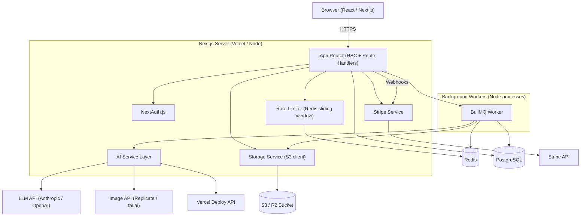
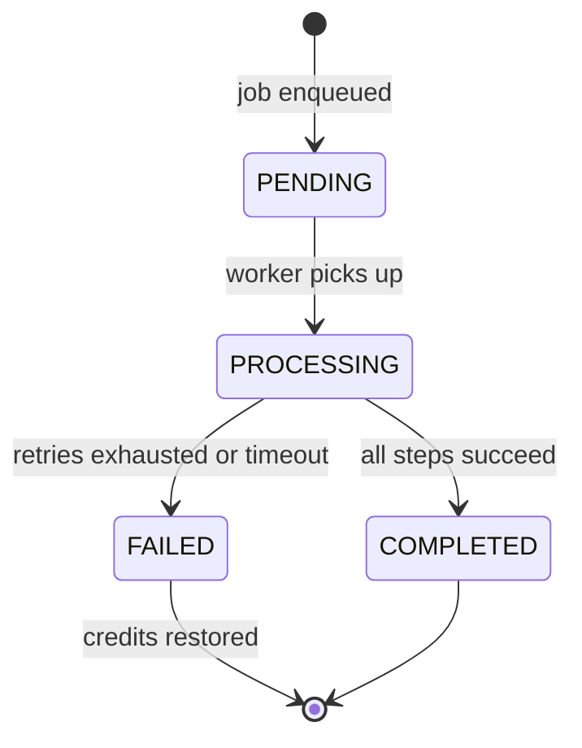
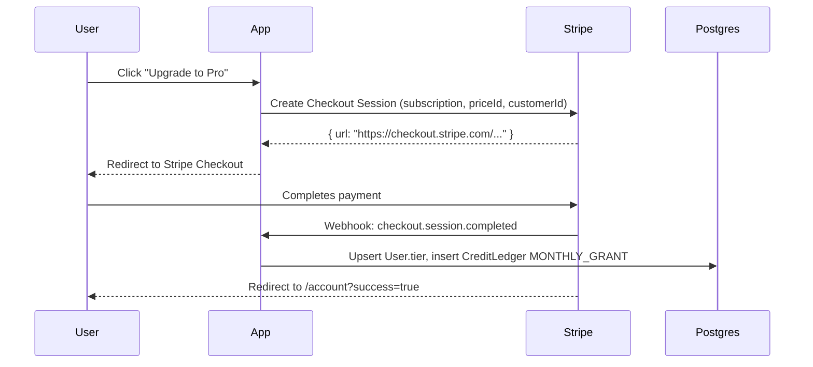
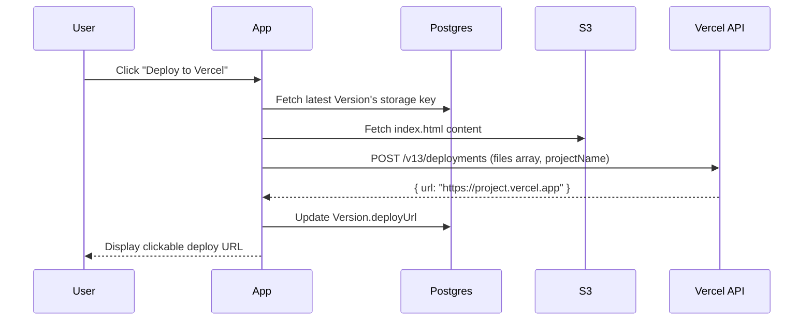
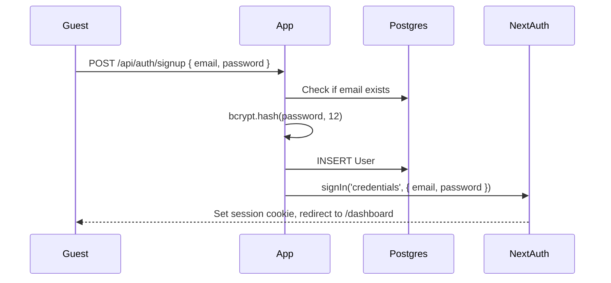
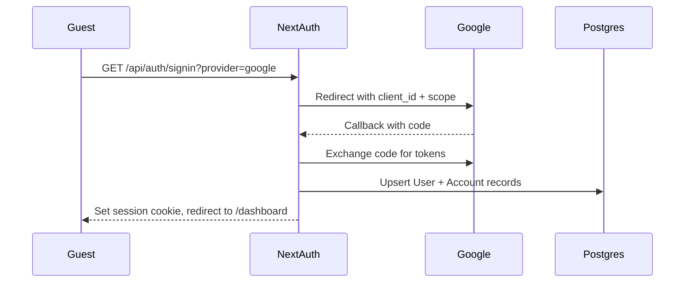
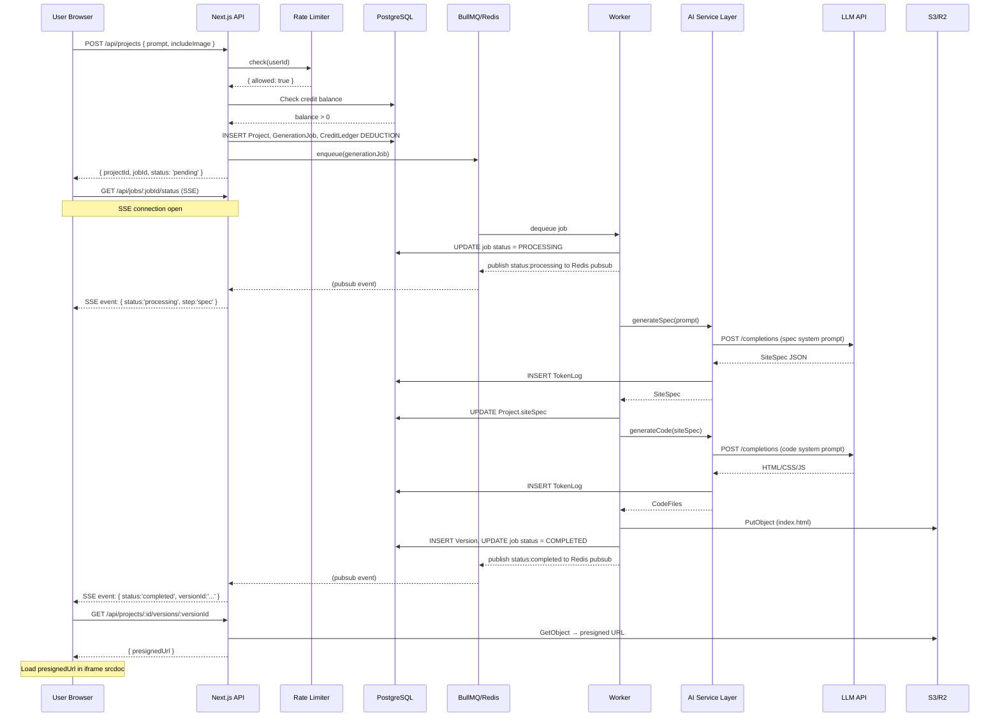
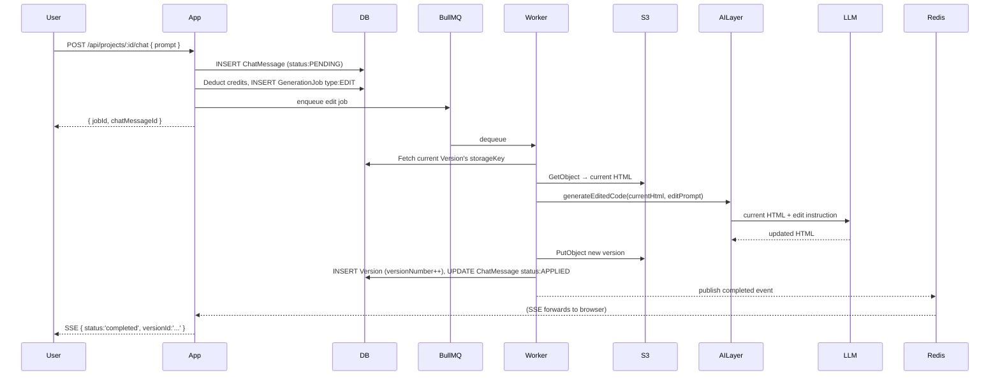
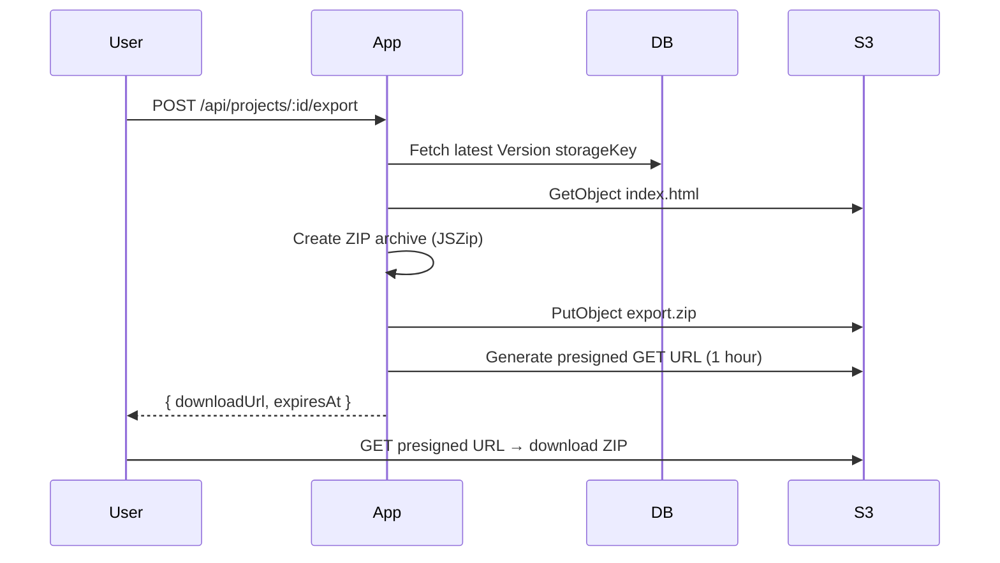

# Design Document: Orbis

## Overview

Orbis is a SaaS platform that turns natural-language prompts into production-ready static websites. The architecture is a Next.js 14 App Router monorepo that handles both the front-end React UI and the server-side API routes. Long-running AI work is offloaded to a BullMQ job queue backed by Redis. PostgreSQL (via Prisma ORM) is the primary data store. Generated assets are stored in an S3-compatible bucket (Cloudflare R2 or AWS S3). Stripe handles all billing. NextAuth.js manages authentication sessions.

The generation pipeline has two stages that run sequentially inside a single Generation_Job:
1. **Spec generation** — LLM converts a user prompt into a structured `Site_Spec` JSON.
2. **Code generation** — LLM converts the `Site_Spec` into self-contained HTML/CSS/JS.

A third optional stage handles hero-image generation via Replicate or fal.ai.

---

## Architecture



### Technology Stack

| Concern | Choice | Rationale |
|---|---|---|
| Framework | Next.js 14 (App Router) | SSR, RSC, API routes in one codebase |
| Language | TypeScript | Type safety across full stack |
| ORM | Prisma | Type-safe DB access, migration tooling |
| Database | PostgreSQL (Supabase or Neon) | Relational, ACID, supports pgcrypto for UUIDs |
| Auth | NextAuth.js v5 | Email/password + OAuth adapters, session management |
| Queue | BullMQ + Redis (Upstash or Redis Cloud) | Persistent jobs, retry, concurrency control |
| Storage | AWS S3 / Cloudflare R2 (S3-compatible) | Scalable object storage, pre-signed URLs |
| Billing | Stripe (Subscriptions + Checkout) | Webhook-driven credit management |
| Styling | Tailwind CSS | Utility-first, responsive breakpoints |
| LLM | Anthropic Claude 3.5 Sonnet (default) or OpenAI GPT-4o | Switchable via env variable |
| Image Gen | Replicate (Stable Diffusion XL) or fal.ai (Flux) | Optional stretch feature |
| Deploy target | Vercel | Serverless Next.js, easy env management |
| Testing | Vitest + React Testing Library + fast-check | Unit, property-based tests |
| E2E | Playwright | Browser automation |

---

## Components and Interfaces

### 1. Next.js App Router — Route Structure

```
app/
  (auth)/
    login/page.tsx
    signup/page.tsx
  (dashboard)/
    dashboard/page.tsx
    projects/[projectId]/page.tsx        ← editor
    account/page.tsx
  api/
    auth/[...nextauth]/route.ts
    projects/
      route.ts                           ← POST create project
      [projectId]/route.ts               ← GET, PATCH, DELETE
      [projectId]/versions/route.ts      ← GET list versions
      [projectId]/versions/[versionId]/route.ts
      [projectId]/export/route.ts        ← GET zip export
      [projectId]/deploy/route.ts        ← POST vercel deploy
      [projectId]/chat/route.ts          ← POST edit prompt
    jobs/
      [jobId]/status/route.ts            ← GET job status (SSE or polling)
    billing/
      checkout/route.ts                  ← POST Stripe Checkout
      portal/route.ts                    ← POST Stripe portal
      webhook/route.ts                   ← POST Stripe webhook
    rate-limit/check/route.ts
```

### 2. AI Service Layer (`lib/ai/`)

```typescript
interface AIServiceLayer {
  generateSpec(prompt: string, jobId: string): Promise<SiteSpec>;
  generateCode(spec: SiteSpec, jobId: string): Promise<CodeFiles>;
  generateEditedCode(currentCode: CodeFiles, editPrompt: string, jobId: string): Promise<CodeFiles>;
  generateHeroImage(spec: SiteSpec, jobId: string): Promise<string>; // returns S3 URL
  deployToVercel(projectName: string, files: CodeFiles, versionId: string): Promise<string>; // returns deploy URL
}
```

Internal modules:
- `lib/ai/providers/anthropic.ts` — wraps Anthropic SDK
- `lib/ai/providers/openai.ts` — wraps OpenAI SDK  
- `lib/ai/providers/replicate.ts` — wraps Replicate SDK
- `lib/ai/retry.ts` — exponential backoff (1s, 2s, 4s, max 16s, max 3 retries)
- `lib/ai/token-logger.ts` — writes `TokenLog` records
- `lib/ai/schema-validator.ts` — validates LLM output against `SiteSpec` JSON schema

### 3. Job Queue (`lib/queue/`)

```typescript
// Job data shape
interface GenerationJobData {
  jobId: string;
  userId: string;
  projectId: string;
  type: 'create' | 'edit';
  prompt: string;
  currentVersionId?: string; // for edit jobs
  includeImageGeneration: boolean;
}

// Worker exports
export const generationWorker: Worker; // processes GenerationJobData
export const generationQueue: Queue;   // enqueue helper
```

### 4. Storage Service (`lib/storage/`)

```typescript
interface StorageService {
  writeVersionFiles(userId: string, projectId: string, versionId: string, files: CodeFiles): Promise<void>;
  readVersionFiles(userId: string, projectId: string, versionId: string): Promise<CodeFiles>;
  writeZipArchive(userId: string, projectId: string, versionId: string, zip: Buffer): Promise<string>; // returns key
  getPresignedUrl(key: string, expiresInSeconds?: number): Promise<string>; // default 3600
  writeImageFile(userId: string, projectId: string, filename: string, buffer: Buffer): Promise<string>;
}
```

Path conventions:
- Version code: `{userId}/{projectId}/{versionId}/index.html`
- ZIP archive:  `{userId}/{projectId}/{versionId}/export.zip`
- Hero image:   `{userId}/{projectId}/images/{filename}`

### 5. Rate Limiter (`lib/rate-limit/`)

```typescript
interface RateLimiter {
  check(userId: string): Promise<{ allowed: boolean; retryAfterMs: number }>;
}
```

Uses Redis `ZADD` / `ZREMRANGEBYSCORE` sliding window on key `rate:{userId}`.
Config loaded from `RATE_LIMIT_MAX_REQUESTS` and `RATE_LIMIT_WINDOW_MS` env variables; changes take effect immediately without restart (values are read on each check).

### 6. Stripe Service (`lib/billing/`)

```typescript
interface StripeService {
  createCheckoutSession(userId: string, priceId: string, mode: 'subscription' | 'payment'): Promise<string>; // URL
  createPortalSession(userId: string): Promise<string>; // URL
  handleWebhook(rawBody: Buffer, signature: string): Promise<void>;
}
```

Webhook events handled:
- `checkout.session.completed` — top-up or new subscription
- `customer.subscription.updated` — tier change, credit reset
- `customer.subscription.deleted` — cancellation
- `invoice.payment_succeeded` — monthly credit refresh

### 7. Auth (`lib/auth/`)

NextAuth v5 with:
- `CredentialsProvider` — bcrypt password hashing, Prisma adapter
- `GoogleProvider` — OAuth 2.0
- Session strategy: JWT (edge-compatible)
- Custom middleware in `middleware.ts` protecting all `(dashboard)` routes

---

## Data Models

### PostgreSQL Schema (Prisma)

```prisma
model User {
  id            String    @id @default(cuid())
  email         String    @unique
  passwordHash  String?
  name          String?
  image         String?
  stripeCustomerId String? @unique
  tier          Tier      @default(FREE)
  createdAt     DateTime  @default(now())
  updatedAt     DateTime  @updatedAt

  accounts      Account[]
  projects      Project[]
  creditLedger  CreditLedger[]
  generationJobs GenerationJob[]
  tokenLogs     TokenLog[]
}

model Account {
  id                String  @id @default(cuid())
  userId            String
  provider          String
  providerAccountId String
  type              String
  access_token      String?
  refresh_token     String?
  expires_at        Int?

  user User @relation(fields: [userId], references: [id], onDelete: Cascade)
  @@unique([provider, providerAccountId])
}

enum Tier {
  FREE
  PRO
  BUSINESS
}

model Project {
  id          String    @id @default(cuid())
  userId      String
  name        String
  prompt      String    @db.Text
  siteSpec    Json?
  thumbnailUrl String?
  totalCreditsUsed Int  @default(0)
  createdAt   DateTime  @default(now())
  updatedAt   DateTime  @updatedAt

  user        User      @relation(fields: [userId], references: [id], onDelete: Cascade)
  versions    Version[]
  jobs        GenerationJob[]
  chatMessages ChatMessage[]
}

model Version {
  id            String    @id @default(cuid())
  projectId     String
  versionNumber Int
  prompt        String?   @db.Text   // the prompt that produced this version
  storageKey    String               // S3 path to index.html
  deployUrl     String?
  createdAt     DateTime  @default(now())

  project       Project   @relation(fields: [projectId], references: [id], onDelete: Cascade)
  @@unique([projectId, versionNumber])
  @@index([projectId])
}
```

```prisma
model GenerationJob {
  id           String    @id @default(cuid())
  userId       String
  projectId    String
  type         JobType   @default(CREATE)
  status       JobStatus @default(PENDING)
  prompt       String    @db.Text
  failureReason String?
  bullJobId    String?
  creditsDeducted Int    @default(0)
  createdAt    DateTime  @default(now())
  updatedAt    DateTime  @updatedAt

  user    User    @relation(fields: [userId], references: [id])
  project Project @relation(fields: [projectId], references: [id])
  creditLedger CreditLedger[]
}

enum JobType {
  CREATE
  EDIT
}

enum JobStatus {
  PENDING
  PROCESSING
  COMPLETED
  FAILED
}

model CreditLedger {
  id              String    @id @default(cuid())
  userId          String
  eventType       CreditEventType
  amount          Int
  balanceAfter    Int
  generationJobId String?
  stripePaymentId String?
  createdAt       DateTime  @default(now())

  user            User      @relation(fields: [userId], references: [id])
  job             GenerationJob? @relation(fields: [generationJobId], references: [id])
  @@index([userId, createdAt])
}

enum CreditEventType {
  DEDUCTION
  TOP_UP
  REFUND
  MONTHLY_GRANT
}

model TokenLog {
  id               String   @id @default(cuid())
  userId           String
  provider         String
  modelName        String
  promptTokens     Int
  completionTokens Int
  estimatedCostUsd Decimal  @db.Decimal(10, 6)
  callType         String   // 'spec' | 'code' | 'edit' | 'image'
  generationJobId  String?
  createdAt        DateTime @default(now())

  user User @relation(fields: [userId], references: [id])
  @@index([userId, createdAt])
}

model ChatMessage {
  id        String   @id @default(cuid())
  projectId String
  prompt    String   @db.Text
  status    ChatStatus @default(PENDING)
  jobId     String?
  createdAt DateTime @default(now())

  project Project @relation(fields: [projectId], references: [id], onDelete: Cascade)
  @@index([projectId, createdAt])
}

enum ChatStatus {
  PENDING
  APPLIED
  FAILED
}
```

### Credit Balance Computation

Credit balance is computed as an aggregate over `CreditLedger`:

```sql
SELECT SUM(CASE WHEN "eventType" IN ('TOP_UP','MONTHLY_GRANT','REFUND') THEN amount
                WHEN "eventType" = 'DEDUCTION' THEN -amount END) AS balance
FROM "CreditLedger"
WHERE "userId" = $1;
```

The `balanceAfter` column is a denormalised cache updated atomically in a database transaction to allow O(1) balance lookups without scanning the full ledger. The source-of-truth is always the full ledger sum.

### Tier Credit Allowances (stored in config, not DB)

```typescript
export const TIER_CONFIG = {
  FREE:     { monthlyCredits: 10,  priceId: null },
  PRO:      { monthlyCredits: 100, priceId: 'price_xxx' },
  BUSINESS: { monthlyCredits: 500, priceId: 'price_yyy' },
} as const;

export const CREDIT_COSTS = {
  CREATE_JOB:  5,
  EDIT_JOB:    2,
  IMAGE_JOB:   3,
} as const;
```

---

## API Route Design

### Authentication
| Method | Path | Auth | Description |
|---|---|---|---|
| POST | `/api/auth/signin` | No | NextAuth credentials sign-in |
| POST | `/api/auth/signup` | No | Custom route: create user + session |
| GET | `/api/auth/session` | No | NextAuth session |
| GET/POST | `/api/auth/[...nextauth]` | - | NextAuth catch-all |

### Projects
| Method | Path | Auth | Description |
|---|---|---|---|
| GET | `/api/projects` | Yes | List user's projects |
| POST | `/api/projects` | Yes | Create project + enqueue job |
| GET | `/api/projects/:id` | Yes | Get project + latest version |
| DELETE | `/api/projects/:id` | Yes | Delete project + all versions |
| GET | `/api/projects/:id/versions` | Yes | List all versions |
| POST | `/api/projects/:id/chat` | Yes | Submit edit prompt + enqueue edit job |
| POST | `/api/projects/:id/export` | Yes | Generate ZIP + return pre-signed URL |
| POST | `/api/projects/:id/deploy` | Yes | Trigger Vercel deploy |

### Jobs
| Method | Path | Auth | Description |
|---|---|---|---|
| GET | `/api/jobs/:jobId/status` | Yes | SSE stream or polling endpoint for job status |

### Billing
| Method | Path | Auth | Description |
|---|---|---|---|
| POST | `/api/billing/checkout` | Yes | Create Stripe Checkout session |
| POST | `/api/billing/portal` | Yes | Create Stripe Customer Portal session |
| POST | `/api/billing/webhook` | No (sig check) | Handle Stripe webhooks |

### Response Shapes

```typescript
// POST /api/projects — create project response
{ projectId: string; jobId: string; status: 'pending' }

// GET /api/jobs/:jobId/status — SSE event data
{ jobId: string; status: JobStatus; versionId?: string; error?: string }

// POST /api/projects/:id/export — export response
{ downloadUrl: string; expiresAt: string }

// POST /api/projects/:id/deploy — deploy response
{ deployUrl: string; versionId: string }
```

---

## Job Queue Design (BullMQ / Redis)

### Queue Names
- `generation` — all Generation_Jobs

### Worker Concurrency
Controlled by env variable `WORKER_CONCURRENCY` (default: 3).

### Job Lifecycle



### Worker Processing Steps

```
generationWorker.process(job):
  1. Update GenerationJob.status = PROCESSING
  2. Check timeout watchdog (max 120s)
  3. Call aiLayer.generateSpec(job.data.prompt, job.id)
     → on failure after 3 retries: goto FAILED
  4. Persist SiteSpec to Project.siteSpec
  5. Call aiLayer.generateCode(siteSpec, job.id)
     → on failure after 3 retries: goto FAILED
  6. IF job.data.includeImageGeneration:
     → Call aiLayer.generateHeroImage(siteSpec, job.id)
     → on failure: continue without image, restore image credits
  7. Write code files to storage bucket
  8. Create Version record (version number = max + 1)
  9. Update GenerationJob.status = COMPLETED, set versionId
  10. Publish SSE event to /api/jobs/:id/status

  FAILED handler:
  → Update GenerationJob.status = FAILED
  → Insert CreditLedger REFUND entry (restore deducted credits)
  → Update balanceAfter
  → Publish SSE failure event
```

### BullMQ Job Options
```typescript
const JOB_OPTIONS: JobsOptions = {
  attempts: 1,          // outer retry is managed inside the worker
  removeOnComplete: 100,
  removeOnFail: 500,
  timeout: 130_000,     // 130s BullMQ hard timeout (10s grace over 120s app timeout)
};
```

### SSE Status Stream

`GET /api/jobs/:jobId/status` — returns `text/event-stream`.

The worker publishes status updates to a Redis pub/sub channel `job:{jobId}`. The SSE route handler subscribes to this channel and forwards events to the client. If the client reconnects, the handler queries `GenerationJob` from Postgres to return the current state immediately.

```
event: status
data: {"jobId":"...","status":"processing","step":"spec"}

event: status
data: {"jobId":"...","status":"completed","versionId":"..."}

event: status
data: {"jobId":"...","status":"failed","error":"LLM API timeout"}
```

---

## AI Service Layer Design

### Provider Abstraction

```typescript
interface LLMProvider {
  complete(params: {
    systemPrompt: string;
    userPrompt: string;
    maxTokens: number;
    model: string;
  }): Promise<{ content: string; promptTokens: number; completionTokens: number }>;
}
```

The active provider is selected at startup from env `AI_PROVIDER=anthropic|openai`.

### Spec Generation Prompt Strategy

System prompt instructs the LLM to output ONLY valid JSON conforming to the `SiteSpec` schema. If the response fails schema validation, a correction message is prepended to the retry call:

```
"Your previous response was not valid JSON. Return only the JSON object. Previous error: {zodError}"
```

### SiteSpec JSON Schema

```typescript
const SiteSpecSchema = z.object({
  pageTitle: z.string(),
  colorPalette: z.object({
    primary:    z.string().regex(/^#[0-9a-fA-F]{6}$/),
    secondary:  z.string().regex(/^#[0-9a-fA-F]{6}$/),
    accent:     z.string().regex(/^#[0-9a-fA-F]{6}$/),
    background: z.string().regex(/^#[0-9a-fA-F]{6}$/),
    text:       z.string().regex(/^#[0-9a-fA-F]{6}$/),
  }),
  sections: z.array(z.object({
    type:       z.enum(['hero','features','about','contact','footer','gallery','pricing','testimonials']),
    heading:    z.string(),
    copy:       z.string(),
    layoutHint: z.string(),
  })).min(1),
});
```

### Code Generation Prompt Strategy

The LLM is instructed to:
1. Output a single self-contained HTML5 file (CSS in `<style>`, JS in `<script>` at body end).
2. Use the exact colors from the `colorPalette`.
3. Implement all sections in the order specified.
4. Use `@media` queries targeting `320px` and above.
5. Pass HTML5 validation (no deprecated tags, valid nesting).

### Retry and Timeout Logic

```typescript
async function withRetry<T>(fn: () => Promise<T>, jobId: string): Promise<T> {
  let delay = 1000;
  for (let attempt = 0; attempt < 3; attempt++) {
    try {
      return await Promise.race([fn(), timeout(60_000)]);
    } catch (err) {
      if (attempt === 2) throw err;
      await sleep(Math.min(delay, 16_000));
      delay *= 2;
    }
  }
  throw new Error('Max retries exceeded');
}
```

### Token Logging

After every API call, a `TokenLog` record is written to Postgres. Cost is computed as:
```
estimatedCostUsd = (promptTokens * inputPricePerToken) + (completionTokens * outputPricePerToken)
```
Per-model pricing is stored in a static config map updated when provider pricing changes.

---

## Storage Layout (S3)

### Bucket Structure

```
{bucket}/
  {userId}/
    {projectId}/
      {versionId}/
        index.html          ← generated code (single HTML file)
        export.zip          ← ZIP archive of index.html
      images/
        {uuid}.png          ← AI-generated hero images
```

### Access Patterns

All reads are via server-generated pre-signed GET URLs (1-hour minimum expiry). Direct bucket access is blocked via bucket policy. The Next.js API routes act as the sole presigning authority.

Versioned code files are written once and never mutated. ZIP files are regenerated on demand if the pre-signed URL has expired.

### S3 Client Configuration

```typescript
// lib/storage/s3Client.ts
import { S3Client } from '@aws-sdk/client-s3';
export const s3 = new S3Client({
  region: process.env.S3_REGION!,
  endpoint: process.env.S3_ENDPOINT,   // for R2: https://{accountId}.r2.cloudflarestorage.com
  credentials: {
    accessKeyId:     process.env.S3_ACCESS_KEY_ID!,
    secretAccessKey: process.env.S3_SECRET_ACCESS_KEY!,
  },
});
```

---

## Stripe Integration Flow

### Subscription Tiers

Three Stripe Products with recurring Prices:
- **Free** — no Stripe product; monthly grant via cron at cycle reset
- **Pro** — `price_pro_monthly` — 100 credits/month
- **Business** — `price_business_monthly` — 500 credits/month

One-off top-up: Stripe Payment Link with `mode: 'payment'` and metadata `{ type: 'top_up', credits: 50 }`.

### Checkout Flow



### Webhook Handler Security

```typescript
// api/billing/webhook/route.ts
const event = stripe.webhooks.constructEvent(
  rawBody,
  req.headers.get('stripe-signature')!,
  process.env.STRIPE_WEBHOOK_SECRET!
);
// Throws on invalid signature → return 400 without touching DB
```

The webhook handler is idempotent: each Stripe event ID is stored in a `StripeEvent` table. If the same event ID arrives twice, the handler returns 200 without reprocessing.

---

## Vercel Deploy Integration Flow



The Vercel API token is stored exclusively in `VERCEL_API_TOKEN` server env variable. The deploy creates a new project per Orbis Project (named `orbis-{projectId}`) or updates the existing one.

---

## Auth Flow (NextAuth)

### Sign-Up (Email/Password)



### Sign-In (Google OAuth)



### Route Protection

`middleware.ts` uses NextAuth's `auth()` helper:

```typescript
export default auth((req) => {
  const isAuthenticated = !!req.auth;
  const isProtectedRoute = req.nextUrl.pathname.startsWith('/dashboard') ||
                           req.nextUrl.pathname.startsWith('/api/projects') ||
                           req.nextUrl.pathname.startsWith('/api/billing');
  if (isProtectedRoute && !isAuthenticated) {
    const loginUrl = new URL('/login', req.url);
    loginUrl.searchParams.set('callbackUrl', req.nextUrl.pathname);
    return Response.redirect(loginUrl);
  }
});
```

---

## Security and Sandboxing Approach

### AI-Generated Code Sandboxing

The Preview component renders generated HTML using:
```html
<iframe
  sandbox="allow-scripts"
  srcdoc={htmlContent}
  style={{ width: '100%', height: '100%', border: 'none' }}
/>
```

`allow-same-origin` is deliberately excluded, preventing the iframe from accessing parent cookies, localStorage, or DOM. The `srcdoc` attribute is used (not `src`) to avoid any network request.

### Content Security Policy

All application pages set:
```
Content-Security-Policy:
  default-src 'self';
  script-src 'self';
  style-src 'self' 'unsafe-inline';
  img-src 'self' data: https:;
  connect-src 'self';
  frame-src 'none';
  object-src 'none';
```

The iframe's `srcdoc` content is isolated from the main CSP via the sandbox boundary.

### SQL Injection Prevention

All DB access goes through Prisma. Raw SQL is prohibited except for the balance aggregate query, which uses parameterised `$1` placeholder via `prisma.$queryRaw` with tagged template literals.

### Secret Management

| Secret | Location |
|---|---|
| `DATABASE_URL` | Server env only |
| `NEXTAUTH_SECRET` | Server env only |
| `STRIPE_SECRET_KEY` | Server env only |
| `STRIPE_WEBHOOK_SECRET` | Server env only |
| `VERCEL_API_TOKEN` | Server env only |
| `AI_API_KEY` | Server env only |
| `S3_SECRET_ACCESS_KEY` | Server env only |

Next.js `NEXT_PUBLIC_` prefix is reserved for non-sensitive config only (e.g., `NEXT_PUBLIC_STRIPE_PUBLISHABLE_KEY`).

---

## Key Sequence Diagrams

### Full Generation Pipeline (Create Project)



### Iterative Edit Flow



### ZIP Export Flow



---

## Error Handling

| Scenario | Handling |
|---|---|
| LLM returns malformed JSON | Retry up to 3x with corrective prompt prefix; mark job FAILED after 3rd attempt |
| LLM API timeout (>60s) | Treat as retriable error; exponential backoff |
| Job stuck >120s | BullMQ stall detection marks job FAILED; credits restored |
| Stripe webhook signature invalid | Return 400; no DB modification |
| Stripe event already processed | Return 200 (idempotent); no duplicate ledger entry |
| Credit balance zero on submit | Return 402; no project/job created |
| Rate limit exceeded | Return 429 with `Retry-After` header |
| Vercel API failure | Log error; return 502 to client; Version record unmodified |
| S3 write failure | Worker retries 3x; job marked FAILED if all retries exhausted |
| Image generation failure | Job continues without image; image credits restored; user notified |

---

## Testing Strategy

### Dual Testing Approach

Unit and property-based tests are implemented using **Vitest** with **fast-check** for property generation. React components use **React Testing Library**. E2E tests use **Playwright**.

### Property-Based Testing

fast-check is chosen for TypeScript compatibility with Next.js/Vitest. Each property test runs a minimum of **100 iterations**.

Test tag format: `// Feature: orbis, Property N: {property_text}`

### Unit Testing Balance

Unit tests focus on:
- Specific happy-path and error-path examples (e.g., sign-up success, sign-in failure)
- Integration points between components (e.g., webhook handler + ledger update)
- Edge cases that property generators might miss

Property tests handle:
- Input validation across all valid/invalid ranges
- Invariants that must hold for all inputs (credit balance, version numbering, token logging)
- Security properties (CSP headers, sandbox attributes)

### Test File Structure

```
__tests__/
  unit/
    auth/
    billing/
    ai-service/
    rate-limiter/
    storage/
    queue/
  property/
    auth.property.test.ts
    billing.property.test.ts
    ai-service.property.test.ts
    rate-limiter.property.test.ts
    generation-pipeline.property.test.ts
    ui-validation.property.test.ts
  integration/
    stripe-webhook.test.ts
    job-queue.test.ts
    storage.test.ts
  e2e/
    auth.spec.ts
    project-generation.spec.ts
    billing.spec.ts
```

---

## Correctness Properties

*A property is a characteristic or behavior that should hold true across all valid executions of a system — essentially, a formal statement about what the system should do. Properties serve as the bridge between human-readable specifications and machine-verifiable correctness guarantees.*

After prework analysis, the following properties were identified. Redundant properties were consolidated (e.g., the credit restoration property applies uniformly to spec failure, code generation failure, edit failure, and image generation failure, so they are merged into one property).

---

### Property 1: Invalid login messages are information-safe

*For any* combination of wrong email, wrong password, or non-existent user, the authentication failure message returned by the system must be identical regardless of which specific field was incorrect.

**Validates: Requirements 1.6**

---

### Property 2: All protected routes redirect unauthenticated requests

*For any* route that requires authentication, an unauthenticated HTTP request must always receive a redirect to the login page (not a 200, 403, or 500 response).

**Validates: Requirements 1.8**

---

### Property 3: Zero-credit users are always blocked from generation

*For any* user whose computed credit balance is zero or negative, any attempt to enqueue a Generation_Job must be rejected without creating a Project, a GenerationJob record, or a CreditLedger deduction entry.

**Validates: Requirements 2.4, 3.4**

---

### Property 4: Credit Ledger entries always contain all required fields

*For any* credit event (deduction, top-up, refund, monthly grant), the persisted CreditLedger record must contain a non-null userId, eventType, amount, balanceAfter, and createdAt timestamp.

**Validates: Requirements 2.5**

---

### Property 5: Subscription downgrade preserves all projects and versions

*For any* user with any number of projects and versions, performing a subscription downgrade or cancellation must leave all Project and Version records intact and retrievable.

**Validates: Requirements 2.7**

---

### Property 6: Invalid Stripe webhook signatures never modify the Credit Ledger

*For any* incoming Stripe webhook request with an invalid, missing, or tampered signature, the system must return a 400 response and the CreditLedger must remain unchanged.

**Validates: Requirements 2.8**

---

### Property 7: Prompt length validation is enforced consistently

*For any* prompt string with length < 10 characters or > 2,000 characters, the project creation endpoint must reject the request with a validation error specifying the character limit, and must not create any Project or GenerationJob record.

**Validates: Requirements 3.5**

---

### Property 8: New projects always have all required fields populated

*For any* successfully created Project, the record must have a non-null and unique id, the correct userId of the submitting user, a non-null createdAt timestamp, and the exact prompt string that was submitted.

**Validates: Requirements 3.6**

---

### Property 9: Credits are always restored on any generation job failure

*For any* Generation_Job (create, edit, or image) that transitions to FAILED status after exhausting retries or timing out, the CreditLedger must contain a REFUND entry of the same amount as the original DEDUCTION, leaving the user's balance equal to the pre-job balance.

**Validates: Requirements 4.4, 5.4, 6.6, 8.6, 18.4**

---

### Property 10: Every LLM and image API call produces a Token_Log record

*For any* call made through the AI Service Layer (spec generation, code generation, edit generation, image generation), a TokenLog record must be written to the database containing non-null values for: provider, modelName, promptTokens (≥ 0), completionTokens (≥ 0), estimatedCostUsd (≥ 0), and createdAt.

**Validates: Requirements 4.5, 5.5, 14.5, 18.5**

---

### Property 11: Generation job statuses are always drawn from the valid set

*For any* GenerationJob at any point in its lifecycle, the status field must be one of: PENDING, PROCESSING, COMPLETED, or FAILED — never null or any other value.

**Validates: Requirements 6.2**

---

### Property 12: Timed-out jobs are marked failed and credits restored

*For any* GenerationJob that remains in PROCESSING status for longer than 120 seconds, the system must transition it to FAILED status and insert a CreditLedger REFUND entry for the originally deducted amount.

**Validates: Requirements 6.6**

---

### Property 13: Preview iframe always uses the minimum sandbox attribute set

*For any* Version rendered in the Preview panel, the iframe element must have a `sandbox` attribute whose value is exactly `"allow-scripts"` — neither more permissive (no `allow-same-origin`, `allow-forms`, `allow-top-navigation`) nor empty.

**Validates: Requirements 7.1, 16.1**

---

### Property 14: All application pages include a correct Content Security Policy header

*For any* HTTP response from an application page route, the `Content-Security-Policy` header must be present and must include `script-src 'self'` (prohibiting inline script execution outside the sandboxed iframe).

**Validates: Requirements 16.2**

---

### Property 15: Edit prompts outside the valid length range are always rejected

*For any* edit prompt string with length < 5 characters or > 1,000 characters, the chat endpoint must reject the request without creating a ChatMessage record or enqueuing a GenerationJob.

**Validates: Requirements 8.1**

---

### Property 16: Edit jobs always include current code in the LLM prompt

*For any* GenerationJob of type EDIT, the prompt sent to the LLM API must contain both the full content of the current Version's HTML and the user's edit instruction string.

**Validates: Requirements 8.3**

---

### Property 17: Version numbers always increment by exactly one

*For any* sequence of versions within a single Project, each new Version's versionNumber must be exactly one greater than the maximum existing versionNumber for that Project at the time of creation.

**Validates: Requirements 8.4, 9.3**

---

### Property 18: Chat messages are always returned in chronological order

*For any* project's chat history containing N messages, the messages must be returned ordered by createdAt ascending such that message[i].createdAt ≤ message[i+1].createdAt for all i in [0, N-2].

**Validates: Requirements 8.5**

---

### Property 19: Reverting a version produces a new version with identical code

*For any* Version V within a Project, triggering a revert to V must create a new Version with versionNumber = (current max + 1) whose stored code is byte-identical to V's stored code.

**Validates: Requirements 9.3**

---

### Property 20: ZIP export never changes the credit balance

*For any* user with any credit balance, performing a ZIP export must leave the CreditLedger and computed credit balance completely unchanged.

**Validates: Requirements 10.4**

---

### Property 21: Vercel deploy never changes the credit balance

*For any* user with any credit balance, initiating a Vercel deploy must leave the CreditLedger and computed credit balance completely unchanged.

**Validates: Requirements 11.4**

---

### Property 22: Vercel deploy failures never corrupt the Version record

*For any* Vercel API error response, the Version record that was the target of the deploy must remain in its pre-deploy state (no deployUrl set or same deployUrl as before), and must not be deleted or have other fields modified.

**Validates: Requirements 11.3**

---

### Property 23: Dashboard project list is always sorted by last-edited date descending

*For any* user with N projects having distinct updatedAt timestamps, the Dashboard API must return the projects in descending order of updatedAt such that projects[i].updatedAt ≥ projects[i+1].updatedAt for all i in [0, N-2].

**Validates: Requirements 12.1**

---

### Property 24: AI Service Layer timeout triggers on all calls exceeding 60 seconds

*For any* LLM or image API call that takes longer than 60,000 ms to respond, the AI Service Layer must raise a timeout error (not wait indefinitely), regardless of which provider is configured.

**Validates: Requirements 14.2**

---

### Property 25: AI Service Layer retry count never exceeds 3 and follows exponential backoff

*For any* failing AI API call, the AI Service Layer must make at most 3 retry attempts, with delays of approximately 1s, 2s, and 4s (±10% jitter), and must not exceed 16s per delay.

**Validates: Requirements 14.3**

---

### Property 26: Rate limiter always rejects requests exceeding the configured limit

*For any* user who submits more than RATE_LIMIT_MAX_REQUESTS generation requests within a rolling 60-second window, all requests beyond the limit must be rejected with a 429 response containing the time remaining before the next request is permitted.

**Validates: Requirements 15.1, 15.2**

---

### Property 27: Storage pre-signed URLs always have at least 1-hour expiry

*For any* file served from the S3 storage bucket, the pre-signed URL generated by the server must have an expiry of at least 3,600 seconds from the time of generation.

**Validates: Requirements 10.3, 17.3**

---

### Property 28: Image generation credit cost is always deducted when opted in

*For any* GenerationJob with `includeImageGeneration = true`, the CreditLedger must include a DEDUCTION entry with amount equal to the configured image credit cost (`CREDIT_COSTS.IMAGE_JOB`), in addition to the base generation deduction.

**Validates: Requirements 18.2**

---

### Property 29: All primary UI views render without horizontal overflow at 320px viewport width

*For any* primary application view (Dashboard, project editor, Chat_Interface, account/billing page) rendered at a viewport width of 320px, no child element should have a rendered width that causes horizontal scrolling (i.e., no element's right edge exceeds 320px).

**Validates: Requirements 19.1**
